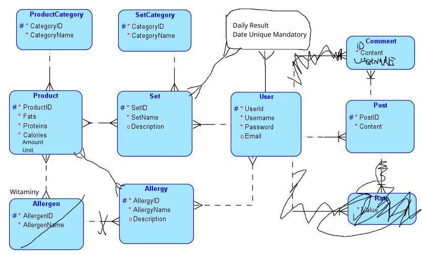

## Fit Apka do liczenia kalorii

Documentation (In Polish):
https://www.overleaf.com/read/pwfzsskkhvht

## TODO
Main:
- [x] Make latex docs.
- [x] Make ERD diagram.
- [x] Configure docker for postgres and Python/FastAPI.
- [x] Create db in Postgres.
- [ ] Make CRUD in FastAPI (7/11)
    - [x] CRUD for User model
    - [x] CRUD for Post model
    - [x] CRUD for Comment model
    - [x] CRUD for Unit model
    - [x] CRUD for Allergen model
    - [x] CRUD for Product model
    - [x] CRUD for ProductCategory model
    - [ ] CRUD for Entry model
    - [ ] CRUD for Diary model
    - [ ] CRUD for SetCategory model
    - [ ] CRUD for Set model
- [ ] Create queries.
- [ ] Pin queries to backend.
- [ ] Pin SQL procedures and functions to backend
- [ ] Create UI in Vue.js.

Optional:
- [x] Make REST API.
- [x] JWT Authentication.

---
# To run the app
    docker-compose build --no-cache
    docker-compose up -d --build
    docker-compose down -v
    docker-compose exec db psql --username=fitapka --dbname=fitapka