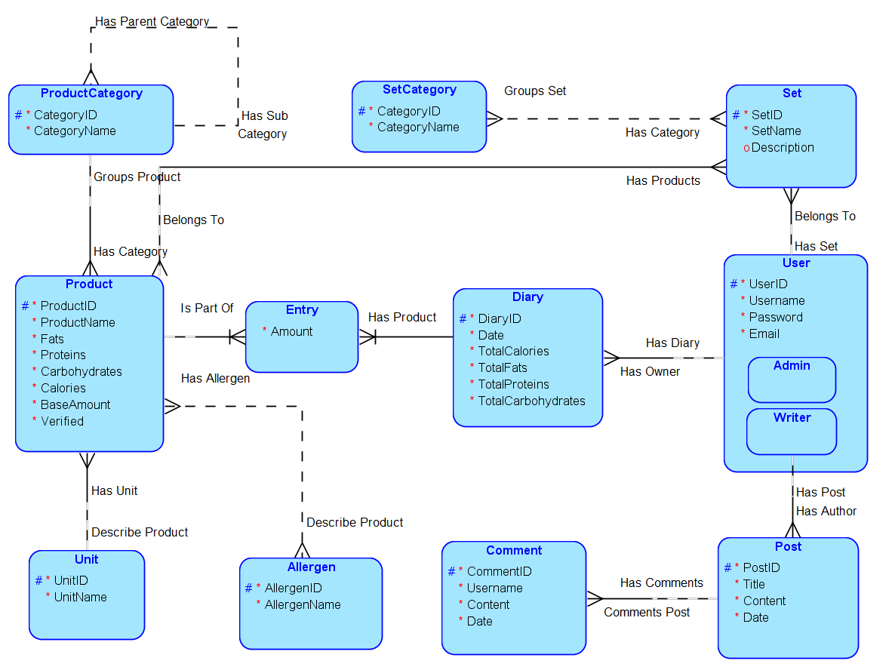

## Fit Apka do liczenia kalorii

Documentation (In Polish):
https://www.overleaf.com/read/pwfzsskkhvht

## TODO
Main:
- [x] Make latex docs.
- [x] Make ERD diagram.
- [x] Configure docker for postgres and Python/Flask.
- [ ] Create db in Postgres.
- [ ] Create simple backend in Flask.
- [ ] Create queries.
- [ ] Pin queries to Flask.
- [ ] Create UI in Vue.js.

Optional:
- [ ] Make REST API.
- [ ] Sign In/Up with Oauth.
- [ ] JWT Authentication.

---
# To run the app
    docker-compose up -d --build